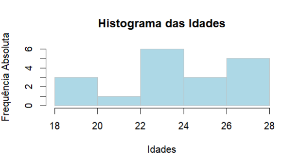

# 📌 Estudo sobre Tabelas de Frequência em R
## Descrição do Projeto

Este projeto demonstra como construir e interpretar tabelas de frequência na linguagem R, utilizando conceitos fundamentais da estatística descritiva.
O objetivo é organizar e resumir um conjunto de dados, neste caso, idades, em diferentes tipos de frequências: absoluta, acumulada, relativa e relativa acumulada.

Através desse estudo, é possível compreender melhor a distribuição dos dados, identificar padrões e tendências, além de visualizar graficamente a distribuição de frequências.

---

## 📌 Conceitos Teóricos
|Tipo de Frequência	| Símbolo |	Definição |
| ------------------- | ------------------- | ------------------ |
| Classes | k | São intervalos de valores que agrupam os dados. |
| Pontos médios | pm | Valores que representam o centro do intervalo das classes. |
| Frequência Absoluta |	f |	Número de vezes que um valor aparece no conjunto de dados. |
| Frequência Acumulada |	F |	Soma acumulada das frequências absolutas até um determinado valor. |
| Frequência Relativa | (%)	f%	| Percentual que representa a proporção de cada valor em relação ao total de observações. |
| Frequência Relativa Acumulada | (%)	F% |	Soma acumulada dos percentuais até aquele valor. |

Essas medidas são amplamente utilizadas em análises exploratórias de dados e visualização estatística.

---

## 📌 Histograma:



---

## 📌 Pré-requisitos
Antes de rodar o projeto, você precisa ter:

* [Linguagem R](https://cran.r-project.org/) instalada (versão recomendada: ≥ 4.5.1)
* [RStudio](https://posit.co/download/rstudio-desktop/) instalado
* Instalação da [Linguagem R:](https://informaticus77-r.blogspot.com/2025/09/blog-post.html)
* Microtutorial [RStudio:](https://informaticus77-r.blogspot.com/2025/09/blog-post_8.html)

---

## 📌 Clonar este repositório
Abra o terminal e execute:
```bash
git clone https://github.com/jcarlossc/tabela_frequencia.git
cd tabela_frequencia
```

---

## 📌 Ativar ambiente virtual com renv
Este projeto utiliza o pacote renv para gerenciar dependências de forma reprodutível.
1. Abra o projeto no RStudio.
2. Ative o ambiente e restaure as dependências:
```
# Estes comandos devem ser executados no console do RStudio.

renv::activate()   # Ativa o ambiente virtual
renv::restore()    # Instala as dependências
```
3. Verifique se tudo está funcionando:
```
# Este comando deve ser executado no console do RStudio.
renv::status()
```

---

## 📌 Sobre
Este material foi criado para servir como introdução ao R, com exemplos simples e organizados para facilitar o aprendizado inicial.

---

## 📌 Contribuições
Se quiser contribuir:
1. Faça um fork deste repositório
2. Crie uma branch para sua feature ou correção (git checkout -b minha-feature)
3. Faça commits descritos claramente
4. Submeta um Pull Request

---

## 📌 Licença
Este projeto está licenciado sob a MIT License.

---

## 📌 Contatos
📌Autor: Carlos da Costa<br>
📌Recife, PE - Brasil<br>
📌Telefone: +55 81 99712 9140<br>
📌Telegram: @jcarlossc<br>
📌Blogger linguagem R: [https://informaticus77-r.blogspot.com/](https://informaticus77-r.blogspot.com/)<br>
📌Blogger linguagem Python: [https://informaticus77-python.blogspot.com/](https://informaticus77-python.blogspot.com/)<br>
📌Email: jcarlossc1977@gmail.com<br>
📌Portfólio em construção: https://portfolio-carlos-costa.netlify.app/<br>
📌LinkedIn: https://www.linkedin.com/in/carlos-da-costa-669252149/<br>
📌GitHub: https://github.com/jcarlossc<br>
📌Kaggle: https://www.kaggle.com/jcarlossc/  
📌Twitter/X: https://x.com/jcarlossc1977

---


